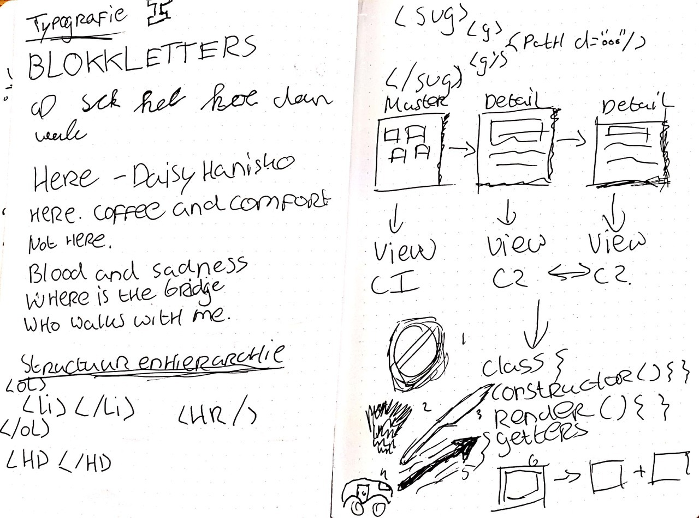
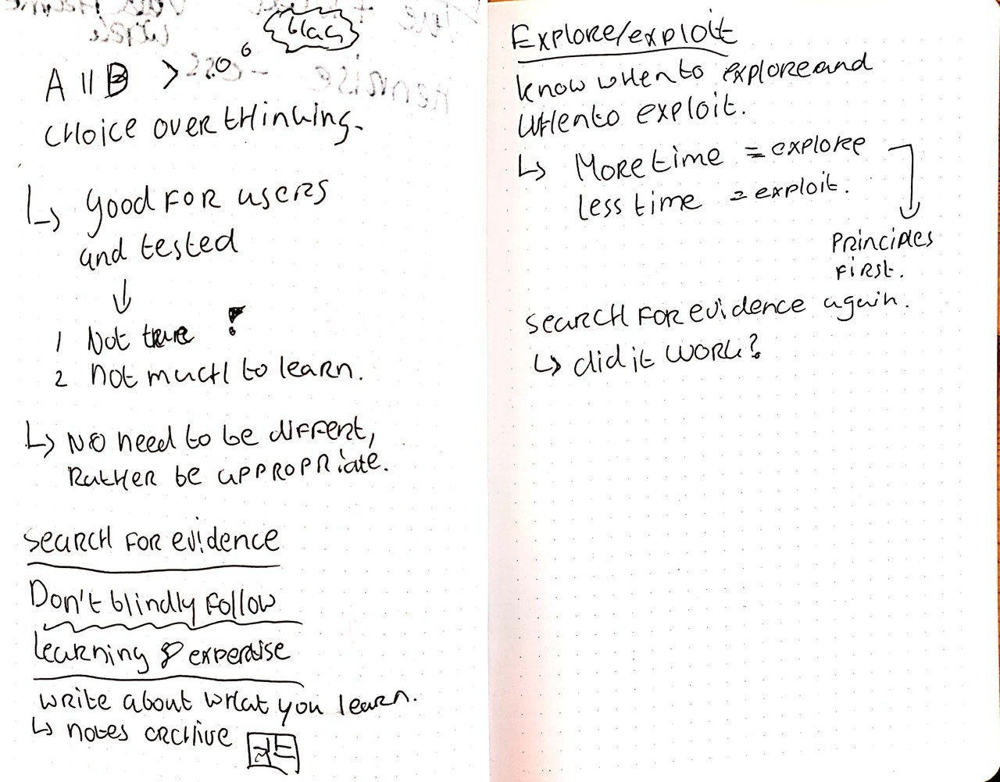

# Minor Web Development

This repository contains all the extra exercises from the minor web development at the UASA.

## Table of contents

* [Weekly geeks](#Weekly-Geeks)
    * [Weekly Geek 1](#Weekly-Geek-1---Maaike-van-Cruchten)
    * [Weekly Geek 2](#Weekly-Geek-2---Stephen-Hay)
    * [Weekly Geek 3](#Weekly-Geek-3---Matise)
    * [~~Weekly Geek 4~~](#Weekly-Geek-4---Maike-Klip)
    * [Weekly Geek 5](#Weekly-Geek-5---Ischa-Gast)
    * [Weekly Geek 6](#Weekly-Geek-6---Voorhoede)
    * [Weekly Geek 7](#Weekly-Geek-7---Daan-Rongen)
* [Weekly mingles](#Weekly-Mingles)
    * [Mirabeau](#Mirabeau)
    * [Q42](#Q42)
    * [Matise](#Matise)
    * [ICATT Interactive Media](#ICATT-Interactive-Media)
    * [Lifely](#Lifely)
    * [Dept](#Dept)
    * [Elastique](#Elastique)
    * [Valtech](#Valtech)
* [Articles](#Articles)
* [License](#License)

## Weekly Geeks

### Weekly Geek 1 - Maaike van Cruchten

Sketches

In this first weekly geek Maaike van Cruchten spoke to us about the art of sketch noting.

Topics:
* Why we should do sketch noting
* What sketch noting actually is
* Shapes
* Typography
* Structure and hierarchy

### Weekly Geek 2 - Stephen Hay

Sketches

This week we had an ICONS meetup with Stephen Hay, who talked about why we should not blindly follow other peoples designs and start to think about why things work in a design, and what flaws this pattern might have.

Topics:
* How design uses conventions
* What the results of blindly following these conventions are
* What excuses people have for using existing patterns
* How we can solve this design sameness, by following a four-step cycle

### Weekly Geek 3 - Matise

Sketches

This weeks weekly geek was more difficult to make notes of, since the two talkers from Matise just briefly talked about how their development stack looked like, followed by a short live-coding session.

Topics:
* What Matise
* What tech stack Matise uses
* How quickly they could setup a Giphy application by using their tech stack

### ~~Weekly Geek 4 - Maike Klip~~

This week I went to home sick.

### Weekly Geek 5 - Ischa Gast

No sketchnotes for this and the following weeks, in my opinion I got too distracted while trying to draw something each time, that I missed a lot of the talk itself, so here are the notes I took:

* An edge case pretty much means that you say you don't care about that user.
* Red on white has got a bad contrast.
* gov.uk is a good website to test usability.
* Use correct HTML, good headings and apply focus styles.
* Hidden styles are bad.
* Color contrast analyzer and accessible-colors.com are good tools to track your color schemes.
* Funkify is an extension to test how diffent users experience your website.
* The Axe browser plugin for Chrome is a good place to test your website for accesibility.
* Sceen reader example: Jaws.
* Often developers value SEO over accessibility.

### Weekly Geek 6 - Voorhoede

* Progressive enhancement is important.
* Write HTML first, then make it nice with CSS and finally add JavaScript.
* Advantages of progressive enhancement: usable outside of the browser scope, SEO, fast loading and good accessibility.

### Weekly Geek 7 - Daan Rongen

* **Skillset**: This pretty much means the ability of a person with relation to their work environment. Previously you were mainly educated within a single field, nowadays that's changing.
* **Mindset**: The culture and personal flow of a person. This requires some tools to get to know of someone.
* **Homo universalis**: The idea that a human can do anything he or she wants, as long as he or she wants it.
* **Sophisticated un-making**: Look at the comparison between adding a fix and redesigning a problem.
* **Conflict of interest**: Humans have a sedentairy lifestyle. The larger part of the day, humans sit to perform work. A sitting culture

## Weekly Mingles

During the minor, every wednesday, we visited a company in the technology branche. Below you will find a short recap of what we did at each company.

### Mirabeau

When we visited Mirabeau we mainly spoke about our personal experiences as developers.
This includes things like: work and internship experiences, our perception of "big" companies.
Furthermore, the two Mirabeau employees talked about what makes Mirabeau Mirabeau, including past projects, customers and the parent company Cognizant.

### Q42

Upon arrival at Q42 I immediately noticed that it would be a fun company to visit, since they had a freaking slide in the office.
We were greeted with drinks by three employees of Q42.

We sat down in a small office room, where they showed us a small presentation with interactive elements, for example: _"How did you get to CMD Amsterdam?"_ and _"What things would you like to build?"_.

I especially liked their wednesday afternoon learning time. Here all employees would get the space and time to look into something that they would like to know more about, related to the work field.

### Matise

Matise has an awesome location right besides Artis, where I have for some reason never been before in my life.

The team of Matise looked very friendly and the people that pitched us the companies ideals, were also the people that participated in the Weekly Geek a few weeks earlier.

From the presentation it didn't get very clear for me, however, what they actually did on a day to day basis, which was unfortunate.

I also really did not like the task they gave us, since it had pretty much nothing to do with web development itself, since we had to think of concepts for a project they were going to pitch for. It almost felt like they just wanted to throw the task over to us and take the best ideas to earn money for it.

Impressions matter, and unfortunately I don't think this was the right company for me.

### ICATT Interactive Media

The location of ICATT is pretty awesome, since it is right in the city center of Amsterdam.
This brings some issues with it immediately which I could not unnotice during the presentation, mainly related to trams passing by very loudly.
I don't know how these people focus on work in this office in the summer where the windows should be open, because it otherwise will get too hot inside.

Anyhow, we listened to a presentation from the CEO of the company, and employees.
Each person represented a piece of the interactive media puzzle. Design, frontend and backend development.

At first I thought these talks where going to be really boring, which in fact it was not, quite the opposite really. However, after us all pitching something about ourselves, I was still left with the feeling that the company did not suit me.

The feeling of the company, that I got, was that it is quite a stale company, this could just be an opinion, because I always compare these kind of companies with each other.

### Lifely

During the weekly mingle at Lifely, I was in Edinburgh for a meeting with our client Wallscope for the final test of this minor.

Luckily I already work at Lifely, so I don't miss anything.

### Dept

Dept was probably, besides Elastique, the most hyped up company of all Weekly Mingles.
I could sort of see why people hyped this up, since they did have a lot of very nice clients where they worked for.
It also looks like the working environment was very nice.

I need to say that I really do not like big companies that much, which caused me to go to this company with some skepticism. On the other hand I start to notice that I like it in a company when there are not too much (with all respect) older people and the mix between male and female is good.

Luckily Dept has got this locked down, at least I feel like so.
The presentation itself was a bit weird, combining a componentization lesson with the companies ideals, but oh well.

### Elastique

Our second to last company that we visited was Elastique.
We had to travel all the way to Hilversum to get to their company.
I am used to traveling distances for work and study, but Elastique is really not in the area where I am concentrated.

Anyhow, at Elastique we talked about all of our strengths and weaknesses in terms of coding and design, and what we wanted to learn in the last year.
I told them that I think the act of conceptual coding is a real strength of me. For the weakness, the fact that I don't take the time to think of how something looks and do research to it, since I just want to get started creating something.
A discussion followed about why I do this study at which point my good mood just fell. I know why I do this study and it is not for everyone to know or judge me about it.

After this discussion they continued to show some of the projects they worked on.
They came up with the term _Angular_ a lot of the times, which was besides the above two things, enough reason for me not to do an internship here unfortunately.

### Valtech

Our last company that we visited was Valtech.
At Valtech, which is situated in the same building as Mirabeau, we got a little tour of the building, after which we got a little presentation about the company.
We then had to introduce ourselves to the two people.
After this we got a (little too long of a) presentation about the Web Bluetooth API, which was very interesting. You can do a lot of things with it I didn't know about. I just didn't see the use cases very much.

## Articles

* [Article 1 - Version control](./articles/VERSION_CONTROL.md)
* [Article 2 - TypeScript](./articles/TYPESCRIPT.md)
* [Article 3 - Unit testing](./articles/UNIT_TESTING.md)

Possible topics:

* **TypeScript** and how it helps you write bug free code without testing it.
* The **React JavaScript library** and in particular the new addition **hooks**. ❌
* How using **BEM** as classnames in **CSS** provides a coding structure that works in SCSS and CSS. ❌
* How **conceptualizing application structure** creates a kick start to your code base. / The best way to start development when creating a new application. ❌
* Writing **tests** (unit or end to end) for JavaScript/TypeScript applications.

## License

This repository is licensed as [MIT](LICENSE) by [Maikel van Veen](https://github.com/maikxx).